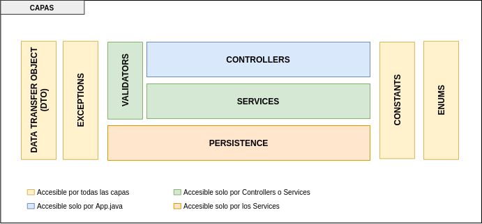

  
  
  

<!-- PROJECT LOGO -->
 

  

  <h3 align="center">Curso de Testing Unitarios con Java</h3>
  
con Andres Sacco</h3> 

Este repositorio contiene todo el código relacionado con el proyecto final que deberán realizar todos los estudiantes del curso.

## Tabla de contenido

Estos son los topicos mas importantes que aparecen en este archivo:
- [Requisitos](#Requisitos)
- [Arquitectura](#Arquitectura)
  - [Capas](#Capas)
  - [Librerias](#Librerias)  
- [Ejecución de la aplicación](#Ejecución-de-la-aplicación)
- [Consideraciones](#Consideraciones)  

## Requisitos

Para poder utilizar el código de este proyecto deberás tener las siguientes herramientas instaladas:
- [Java 11](https://www.oracle.com/ar/java/technologies/javase-jdk11-downloads.html)
- [Maven](https://maven.apache.org/)
- [Git](https://git-scm.com/)
- **IDE**:
  - [IntelliJ](https://www.jetbrains.com/es-es/idea/download/) - **Recomendado**
  - [Eclipse](https://www.eclipse.org/downloads/)
  
## Arquitectura
Esta aplicación tiene una arquitectura básica sin el uso de ninguna base de datos o algún elemento externo ya que la idea de la misma es que los estudiantes se centren en la tarea de realizar test unitarios.
  
### Capas
  
La aplicación esta separada en distintas capas cada una tiene una funcionalidad especifica. Veamos primero cuales son las capas que posee la aplicación:

  
Ahora una breve explicación acerca de cada una de las capas:
  
  | Capa          | Descripción                                                                                                             | Package               |
  |---------------|-------------------------------------------------------------------------------------------------------------------------|-----------------------|
  | Controllers   | En esta capa encontraras toda la lógica para realizar las distintas acciones                                            | *.controller          |
  | Constants     | Contiene las constantes de elementos que serán usados para mostrar algún mensaje ya sea de error o de información       | *.constant            |
  | DTO           | Contiene los objetos que serán usados en las distintas capas de la explicación para trasladar información               | *.dto                 |
  | Exceptions    | Contiene todas las excepciones que se usaran a lo largo de la aplicación para reportar un error                         | *.exception           |
  | Enums         | Contiene todas las enumeraciones con sus posibles valores                                                               | *.enums               |
  | Persistence   | Esta capa se encarga de todo lo que es la persistencia de la aplicación, en este caso en un archivo                     | *.persistence         |
  | Services      | Contiene toda la lógica de validaciones y de negocio acerca de que debe hacer la explicación                            | *.service             |
  | Validators    | Se encarga de validar que los valores introducidos sean validos para ser usados                                         | *.validator           |

### Librerias

La aplicación usa una serie de librerias:
- **[Gson](https://github.com/google/gson)** es una libreria que se encarga de la serializacion y deserializacion de objetos a JSON o viceversa.
- **[Apache Commons Lang](https://commons.apache.org/proper/commons-lang/)** esta libreria provee una serie de funcionalidades que evitan la creación de código duplicado, por ejemplo en esta aplicación se utiliza para validar que las cadenas de texto posean algún valor.

## Ejecución de la aplicación

Para ejecutar la aplicación se debera abrir la clase **App** y ejecutarla ya que contiene el punto de ejecucion de la misma.

## Consideraciones

Algunas consideraciones que van a hacer que los estudiantes logren un mejor resultado:
- Las librerías de testing que se vayan a agregar se deben considerar agregarlas en el **pom.xml** con **<scope>test</scope>** esto hace que las mismas solo se agreguen en la etapa de testing. Si por alguna razón se genera el jar de la aplicación la misma no contendrá las librerías de testing, ya que no son necesarias para que la aplicación funcione.a aplicación la misma no contendrá las librerías de testing, ya que no son necesarias para que la aplicación funcione.
- Para buscar cual es la ultima version de las librerías se recomienda usar [mvnrepository](https://mvnrepository.com/)

## Licencia

Distribuido bajo la licencia MIT License. 

(<a href="#top">back to top</a>)

<!-- CONTACT -->
## Contacto

¿Tienes comentarios sobre los archivos del curso? Envíanos un correo a proyectos@crehana.com

(<a href="#top">back to top</a>)

